# AzureLaunch — Python FastAPI + Azure Container Registry

Deployed via GitHub Actions CI/CD.

---

## Project Structure

```
azurelaunch/
├── backend/
│   ├── main.py            # FastAPI app (/, /health, /version)
│   ├── pyproject.toml     # uv project dependencies
│   └── Dockerfile
├── frontend/
│   ├── index.html
│   ├── nginx.conf
│   └── Dockerfile
├── scripts/
│   └── azure-setup.sh     # Reference only — run commands manually
├── .github/workflows/
│   ├── ci.yml             # Build + smoke test on every push/PR
│   └── cd.yml             # Push images to ACR on merge to main
└── .gitignore
```

---

## CI/CD Flow Diagram



## CI/CD Flow Diagram (ASCII)

```
Local Dev  ──git push──►  GitHub Repo (main)
                                │
                    ┌───────────┴───────────┐
                    ▼                       ▼
              CI workflow             CD workflow
              (ci.yml)                (cd.yml)
                    │                       │
                    ▼                       ▼
            Docker build            Docker build
            backend+frontend        backend+frontend
                    │                       │
                    ▼                       ▼
            Smoke tests             Azure login (OIDC)
            GET /                   no passwords
            GET /health                     │
            GET /version                    ▼
                    │               docker push
            PR ✓ green              azurelaunchacr.azurecr.io
                                    :latest + :<git-sha>
                                            │
                                            ▼
                                  Azure Container Registry
                                  azurelaunchacr10033.azurecr.io
```

| Step | What happens |
|---|---|
| Step 0–1 | Create folders, write FastAPI app, run locally with `uv` |
| Step 2–3 | Push to GitHub, CI builds + smoke tests on every PR |
| Step 3 | Add Azure secrets, CD workflow activates on merge to main |
| Step 4 | OIDC login → `docker push` → images land in ACR |

Images are tagged with both `latest` and the git commit SHA for full traceability.

---

## Prerequisites — Azure Account & Azure CLI

### 1. Create a Free Azure Account

1. Go to [azure.microsoft.com/free](https://azure.microsoft.com/free)
2. Click **Start free** and sign in with a Microsoft account (or create one)
3. You get **$200 free credit** for 30 days
4. Once signed in, go to [portal.azure.com](https://portal.azure.com) to confirm your account is active
5. Note your **Subscription ID** — you'll need it in Step 4
   - In Azure Portal → search **Subscriptions** → copy the Subscription ID

---

### 2. Install Azure CLI

**Mac:**
```bash
brew install azure-cli
```

**Windows (recommended):**
```powershell
winget install Microsoft.AzureCLI
```

**Windows (alternative — download MSI):**
Go to https://aka.ms/installazurecliwindows and run the installer.

**Linux (Ubuntu/Debian):**
```bash
curl -sL https://aka.ms/InstallAzureCLIDeb | sudo bash
```

Verify it worked:
```bash
az --version
```

> ⚠️ **Windows users** — after installing, fully close and reopen your terminal (PowerShell, Git Bash, or Cursor). The PATH only updates on terminal restart.

> ⚠️ **Cursor terminal users** — if `az` works in standalone PowerShell but not in Cursor, run this in Cursor's terminal:
> ```powershell
> # Find where az is installed (run in working PowerShell first)
> (Get-Command az).Source
> # Then add that folder to PATH in Cursor terminal e.g.
> $env:PATH += ';C:\Program Files\Microsoft SDKs\Azure\CLI2\wbin'
> ```
> To fix permanently, add that path via System Properties → Environment Variables → PATH, then restart Cursor.

---

### 3. Login to Azure via CLI

```bash
az login
```

This opens a browser — sign in with the same account used to create the Azure account.

Confirm login worked:
```bash
az account show
```

You should see your subscription name, ID and state printed.

---

### 4. Register Azure Container Registry provider

> ⚠️ New Azure subscriptions need this — skip if you've used ACR before.

```bash
az provider register --namespace Microsoft.ContainerRegistry --wait
```

Verify:
```bash
az provider show --namespace Microsoft.ContainerRegistry --query registrationState
```

Should print `"Registered"`.

---

## Step 0 — Create Project Folder Structure

**Mac/Linux/Git Bash:**
```bash
mkdir -p azurelaunch/{backend,frontend,scripts,.github/workflows}
cd azurelaunch && touch backend/{main.py,Dockerfile} frontend/{index.html,nginx.conf,Dockerfile} scripts/azure-setup.sh .github/workflows/{ci.yml,cd.yml} .gitignore
```

**Or step by step (works everywhere including PowerShell):**
```powershell
mkdir azurelaunch
cd azurelaunch
mkdir backend
mkdir frontend
mkdir scripts
mkdir .github\workflows
```

> ⚠️ **Windows/PowerShell users** — brace expansion `{backend,frontend}` is bash only and will error in PowerShell. Use the step by step commands above instead.

Your folder should look like this:
```
azurelaunch/
├── backend/
│   ├── main.py
│   ├── pyproject.toml
│   └── Dockerfile
├── frontend/
│   ├── index.html
│   ├── nginx.conf
│   └── Dockerfile
├── scripts/
│   └── azure-setup.sh
├── .github/
│   └── workflows/
│       ├── ci.yml
│       └── cd.yml
└── .gitignore
```

> ⚠️ There are **2 Dockerfiles** — one in `backend/` for FastAPI and one in `frontend/` for nginx. Make sure both exist before pushing.

---

## Step 1 — Create Virtual Environment (local dev)

```bash
# Install uv if you don't have it
pip install uv

cd backend

# Use --no-vcs flag to prevent uv from creating a nested git repo
uv init --no-vcs

uv add fastapi uvicorn
uv run uvicorn main:app --reload    # → http://localhost:8000
```

> ⚠️ **Important** — always use `uv init --no-vcs` inside an existing git repo. Without it, `uv init` creates its own `.git` folder inside `backend/` which causes this error when you run `git add .`:
> ```
> error: 'backend/' does not have a commit checked out
> fatal: adding files failed
> ```
> If this happens, fix it with: `rm -rf backend/.git`

> ⚠️ **pyproject.toml** — make sure `requires-python = ">=3.11"` matches the Python version in your Dockerfile. If `uv init` sets it to `>=3.12` but Dockerfile uses `python:3.11-slim`, the Docker build will fail with a dependency resolution error.

Test endpoints locally:
- `http://localhost:8000/`        → Hello to my world!
- `http://localhost:8000/health`  → {"status":"healthy"}
- `http://localhost:8000/version` → {"version":"1.0.0"}
- `http://localhost:8000/docs`    → FastAPI auto-generated docs

---

## Step 2 — Create GitHub Repo

**Option A — GitHub CLI:**
```bash
cd ..   # back to project root
git init
git add .
git commit -m "Initial commit — AzureLaunch"
gh repo create azurelaunch --public --push --source=.
```

> ⚠️ If `gh` command not found, install GitHub CLI: `winget install GitHub.cli` then restart terminal and run `gh auth login`

**Option B — Manual (no GitHub CLI needed):**
1. Go to [github.com/new](https://github.com/new)
2. Name it `azurelaunch`, set to **Public**
3. **Do NOT** tick Add README, Add .gitignore — leave everything unchecked
4. Click **Create repository**
5. Run the commands GitHub shows under "push an existing repository":
```bash
git init
git add .
git commit -m "Initial commit — AzureLaunch"
git remote add origin https://github.com/YOUR_USERNAME/azurelaunch.git
git branch -M main
git push -u origin main
```

---

## Step 3 — Azure Infrastructure Setup

Run these commands one by one. Replace placeholder values with your own.

```bash
# Set your subscription
SUBSCRIPTION_ID="YOUR_SUBSCRIPTION_ID"
az account set --subscription "$SUBSCRIPTION_ID"

# Create resource group
az group create --name azurelaunch-rg --location eastus

# Create Azure Container Registry (name must be alphanumeric only, 5-50 chars, no hyphens)
az acr create --resource-group azurelaunch-rg --name azurelaunchacr$RANDOM --sku Basic --admin-enabled false

# Note the ACR name printed — you'll need it below
ACR_NAME="azurelaunchacr12345"   # replace with actual name from above
```

> ⚠️ **ACR name rules** — alphanumeric only, no hyphens, underscores or dots. `azurelaunch-acr` will fail. Use `azurelaunchacr` instead.

> ⚠️ **If ACR creation fails** with `MissingSubscriptionRegistration`, register the provider first:
> ```bash
> az provider register --namespace Microsoft.ContainerRegistry --wait
> ```

```bash
# Create App Registration for GitHub Actions
APP_ID=$(az ad app create --display-name "azurelaunch-github-actions" --query appId --output tsv)
echo "App ID: $APP_ID"

# Create Service Principal
SP_OBJ_ID=$(az ad sp create --id $APP_ID --query id --output tsv)
echo "SP Object ID: $SP_OBJ_ID"
```

> ⚠️ If you see `service principal name App id is already in use`, the app already exists from a previous run. Fetch it instead:
> ```bash
> APP_ID=$(az ad app list --display-name "azurelaunch-github-actions" --query "[0].appId" --output tsv)
> SP_OBJ_ID=$(az ad sp show --id $APP_ID --query id --output tsv)
> ```

```bash
# Get resource IDs
RG_ID=$(az group show --name azurelaunch-rg --query id --output tsv)
ACR_ID=$(az acr show --name $ACR_NAME --query id --output tsv)
```

### Assign Roles (Azure Portal — recommended)

> ⚠️ Role assignment via CLI can fail with `MissingSubscription` errors. Use the Portal instead — it's more reliable.

**Contributor on Resource Group:**
1. Portal → Resource Groups → azurelaunch-rg
2. Left menu → Access control (IAM) → Add → Add role assignment
3. Tab: **Privileged administrator roles** → select **Contributor** → Next
4. Members → Select members → search `azurelaunch-github-actions` → Select
5. Review + assign twice

**AcrPush on Container Registry:**
1. Portal → Container registries → your ACR
2. Left menu → Access control (IAM) → Add → Add role assignment
3. Search **AcrPush** → select → Next
4. Members → Select members → search `azurelaunch-github-actions` → Select
5. Review + assign twice

### Set up OIDC Federated Credential

```bash
# Get your GitHub username and check your actual repo subject format
# Replace YOUR_GITHUB_USERNAME with your actual username
az ad app federated-credential create --id $APP_ID --parameters "{\"name\": \"github-main\", \"issuer\": \"https://token.actions.githubusercontent.com\", \"subject\": \"repo:YOUR_GITHUB_USERNAME/azurelaunch:ref:refs/heads/main\", \"audiences\": [\"api://AzureADTokenExchange\"]}"
```

> ⚠️ **OIDC subject mismatch** — if CD fails with `AADSTS700213: No matching federated identity record`, check the exact subject claim GitHub is sending in the workflow logs under `Run azure/login`. Copy that exact string and use it as the subject. Example:
> ```
> subject claim - repo:username@12345/reponame@67890:ref:refs/heads/main
> ```
> Delete and recreate the credential with that exact subject:
> ```bash
> az ad app federated-credential delete --id $APP_ID --federated-credential-id github-main
> az ad app federated-credential create --id $APP_ID --parameters "{\"name\": \"github-main\", \"issuer\": \"https://token.actions.githubusercontent.com\", \"subject\": \"EXACT_SUBJECT_FROM_LOGS\", \"audiences\": [\"api://AzureADTokenExchange\"]}"
> ```

### Print GitHub Secrets

```bash
TENANT_ID=$(az account show --query tenantId --output tsv)
ACR_LOGIN_SERVER=$(az acr show --name $ACR_NAME --query loginServer --output tsv)

echo "====== ADD THESE TO GITHUB SECRETS ======"
echo "AZURE_CLIENT_ID       = $APP_ID"
echo "AZURE_TENANT_ID       = $TENANT_ID"
echo "AZURE_SUBSCRIPTION_ID = $SUBSCRIPTION_ID"
echo "ACR_NAME              = $ACR_NAME"
echo "ACR_LOGIN_SERVER      = $ACR_LOGIN_SERVER"
echo "=========================================="
```

> ⚠️ **These values are sensitive** — do not commit them to your repo, share them in chat, or save them in plain text files. Only add them to GitHub Secrets.

---

## Step 3 — Add GitHub Secrets

Go to `https://github.com/YOUR_USERNAME/azurelaunch/settings/secrets/actions`

Click **New repository secret** for each:

| Secret | Value |
|---|---|
| `AZURE_CLIENT_ID` | from output above |
| `AZURE_TENANT_ID` | from output above |
| `AZURE_SUBSCRIPTION_ID` | your subscription ID |
| `ACR_NAME` | e.g. `azurelaunchacr12345` |
| `ACR_LOGIN_SERVER` | e.g. `azurelaunchacr12345.azurecr.io` |

---

## Step 4 — Deploy to ACR

Push to main to trigger the CD pipeline:

```bash
git add .
git commit -m "Initial commit — AzureLaunch"
git push origin main
```

Go to your GitHub repo → **Actions** tab and watch the workflows run.

**CI workflow** should show all green:
- ✅ Build backend Docker image
- ✅ Smoke test GET / /health /version
- ✅ Build frontend Docker image
- ✅ Smoke test frontend /health

**CD workflow** should show all green:
- ✅ Login to Azure
- ✅ Login to ACR
- ✅ Build + push backend image
- ✅ Build + push frontend image

**Verify images landed in ACR:**
```bash
az acr repository list --name $ACR_NAME --output table
az acr repository show-tags --name $ACR_NAME --repository azurelaunch-backend --output table
az acr repository show-tags --name $ACR_NAME --repository azurelaunch-frontend --output table
```

Or in Azure Portal → Container registries → your ACR → Repositories.

---

## Common Errors & Fixes

| Error | Fix |
|---|---|
| `az: command not found` in Cursor | Add Azure CLI to PATH: `$env:PATH += ';C:\Program Files\Microsoft SDKs\Azure\CLI2\wbin'` |
| `MissingSubscriptionRegistration` | Run `az provider register --namespace Microsoft.ContainerRegistry --wait` |
| `MissingSubscription` on role assignment | Use Azure Portal IAM instead of CLI |
| `Registry names may contain only alphanumeric` | Remove hyphens/underscores from ACR name |
| `backend/ does not have a commit checked out` | Run `rm -rf backend/.git` — caused by `uv init` without `--no-vcs` |
| `No solution found when resolving dependencies` | Set `requires-python = ">=3.11"` in pyproject.toml to match Dockerfile |
| `AADSTS700213 No matching federated identity` | Check exact subject claim in workflow logs and recreate federated credential with that exact string |
| Brace expansion error in PowerShell | Use individual `mkdir` commands instead of `mkdir -p {a,b,c}` |

---

## Container Apps Deployment (Auto-deploy via CD)

Once the one-time setup is done, every `git push` to main automatically:
1. Builds and pushes images to ACR
2. Deploys to Azure Container Apps
3. Smoke tests the live URLs

### One-time Container Apps Setup

Edit the variables at the top of `scripts/setup-container-apps.sh` then run:

```bash
chmod +x scripts/setup-container-apps.sh
./scripts/setup-container-apps.sh
```

> ⚠️ The `az containerapp env create` step takes **5–10 minutes** — this is normal. Do not cancel it. It is provisioning a full Kubernetes-based environment underneath.

> ⚠️ If it fails with `MissingSubscription`, run `az account set --subscription "YOUR_SUBSCRIPTION_ID"` first.

---

### Fix Frontend → Backend Connection

After deploying to Container Apps, clicking **Ping AzureLaunch API** on the frontend will show `Error: Failed to fetch` because the frontend defaults to `localhost:8000`.

**Step 1 — Get your backend FQDN:**
```bash
az containerapp show \
  --name azurelaunch-backend \
  --resource-group azurelaunch-rg \
  --query properties.configuration.ingress.fqdn \
  --output tsv
```

**Step 2 — Update `frontend/index.html`:**

Find this line:
```javascript
const BACKEND = window.BACKEND_URL || 'https://REPLACE_WITH_YOUR_BACKEND_FQDN';
```

Replace with your actual backend URL:
```javascript
const BACKEND = window.BACKEND_URL || 'https://azurelaunch-backend.kindriver-e93cab17.eastus.azurecontainerapps.io';
```

**Step 3 — Push to trigger auto-deploy:**
```bash
git add frontend/index.html
git commit -m "fix: set live backend URL"
git push origin main
```

Wait for CD pipeline to go green (~3 mins) then open your frontend and click **Ping AzureLaunch API**.

---

### Live URLs

| Service | URL |
|---|---|
| Backend | https://azurelaunch-backend.kindriver-e93cab17.eastus.azurecontainerapps.io |
| Frontend | https://azurelaunch-frontend.kindriver-e93cab17.eastus.azurecontainerapps.io |

### Verify deployment

```bash
# Check backend is live
curl https://azurelaunch-backend.kindriver-e93cab17.eastus.azurecontainerapps.io/health

# Check frontend is live  
curl https://azurelaunch-frontend.kindriver-e93cab17.eastus.azurecontainerapps.io/health

# List all images in ACR
az acr repository list --name azurelaunchacr10033 --output table

# Check Container App status
az containerapp show --name azurelaunch-backend --resource-group azurelaunch-rg --query properties.runningStatus --output tsv
az containerapp show --name azurelaunch-frontend --resource-group azurelaunch-rg --query properties.runningStatus --output tsv
```

---

## Full Architecture

```
Developer Machine
  └── uv init --no-vcs
  └── uv add fastapi uvicorn
  └── git push origin main
          │
          ▼
    GitHub Actions
      ├── CI (ci.yml)
      │     └── build + smoke test locally
      │
      └── CD (cd.yml)
            ├── Job 1: Build + push to ACR
            │         azurelaunchacr10033.azurecr.io
            │         :latest + :<git-sha>
            │
            ├── Job 2: Deploy to Container Apps
            │         az containerapp update backend
            │         az containerapp update frontend
            │
            └── Job 3: Smoke test live URLs
                      GET /health ✅
                      GET /       ✅
                      GET /version ✅
```
